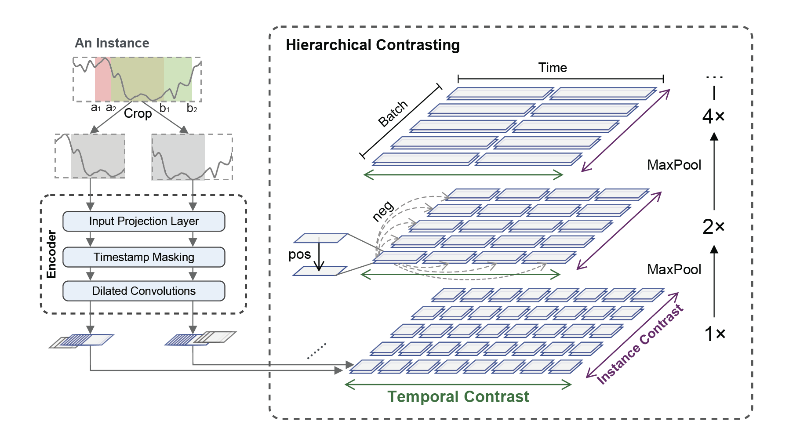
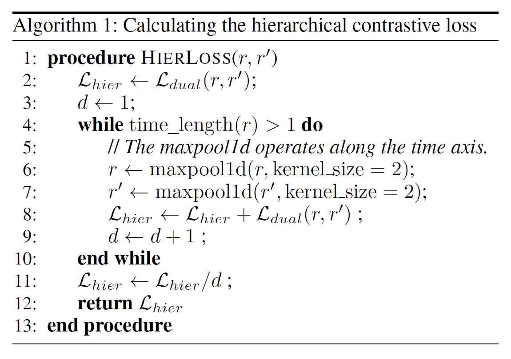
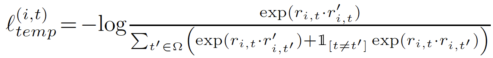
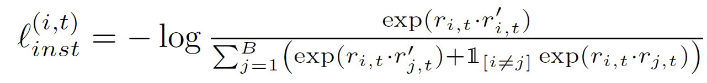
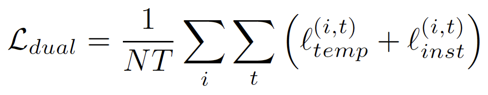

# ts2vec-Paddle

## 目录

- [1. 简介]()
- [2. 数据集]()
- [3. 复现精度]()
- [4. 模型目录与环境]()
    - [4.1 目录介绍]()
    - [4.2 准备环境]()
- [5. 开始使用]()
    - [5.1 模型训练与评估]()
- [6. 自动化测试脚本]()
- [7. LICENSE]()
- [8. 模型信息]()

## 1. 简介
**论文:** [TS2Vec: Towards Universal Representation of Time Series](https://arxiv.org/abs/2106.10466)

#### 整体框架

论文提出了一种用于学习时间序列在任意语义层次表示的通用框架ts2vec。与现有的方法不同，ts2vec在增强的上下文视图上以分层的方式执行对比学习，从而为每个时间戳提供健壮的上下文表示。此外，为了得到时间序列中任意子序列的表示，我们可以对相应时间戳的表示进行简单的聚合。论文在时序分类、异常检测和预测任务上均达到了SOTA效果，并且时间消耗较低。论文的对比学习方式：

- 实例级别层次，instance-wise

- 时序维度层次，temporal dimension

通过上述两者的协作，可以使得ts2vec能够学习到任意粒度的时序表示信息。具体的模型结构如下图所示：

****

#### 数据增强方式

正负样本对的选取对于对比学习而言是至关重要的，论文提出的Contextual Consistency方法是通过随机裁剪（random cropping）获得相互重叠的时间序列片段，并通过编码器中定义的映射层（projector）实现时间戳屏蔽（timestamp masking）完成数据增强。

#### 损失函数

论文基于timestamp-level的表征，在时间粒度以及实例级维度通过max pooling的方法迭代计算出instance-level 的表征。同时，为了让编码器更好的学习到时间序列在不同粒度下的表征，论文提出了一个新的层次对比损失，该损失强制编码器在不同尺度上学习表征，算法如下：



为了学习随时间变化的不同表征，ts2vec将输入时间序列两个视图中相同时间戳处的表示作为正表征，而将同一时间序列中不同时间戳处的表示作为负表征。第i个时间序列在时间戳t的时间尺度对比损失可以表示为：



实例级别的对比损失可以表示为：



最终损失函数定义为：



#### 回归模型

岭回归


## 2. 数据集

复现论文中，table7 table8 (etth1、ettm1两份数据集)

数据集[下载地址](https://github.com/zhouhaoyi/ETDataset)

使用paddleTS获取etth1、ettm1两份数据集。

## 3. 复现精度

### ETTh1数据集单变量时间序列数据预测结果

|  H   | 原论文 MSE | 原论文 MAE | 复现 MSE | 复现 MAE |
| :--: | :--------: | :--------: | :------: | :------: |
|  24  |   0.039    |   0.152    |  0.045   |  0.159   |
|  48  |   0.062    |   0.191    |  0.062   |  0.188   |
| 168  |   0.134    |   0.282    |  0.125   |  0.269   |
| 336  |   0.154    |   0.310    |  0.179   |  0.335   |
| 720  |   0.163    |   0.327    |  0.426   |  0.589   |

### ETTm1数据集单变量时间序列数据预测结果

|  H   | 原论文 MSE | 原论文 MAE | 复现 MSE | 复现 MAE |
| :--: | :--------: | :--------: | :------: | :------: |
|  24  |   0.015    |   0.092    |  0.015   |  0.090   |
|  48  |   0.027    |   0.126    |  0.029   |  0.125   |
|  96  |   0.044    |   0.161    |  0.048   |  0.164   |
| 288  |   0.103    |   0.246    |  0.099   |  0.241   |
| 672  |   0.156    |   0.307    |  0.150   |  0.303   |

### ETTh1数据集多变量时间序列数据预测结果

|  H   | 原论文 MSE | 原论文 MAE | 复现 MSE | 复现 MAE |
| :--: | :--------: | :--------: | :------: | :------: |
|  24  |   0.599    |   0.534    |  0.613   |  0.557   |
|  48  |   0.629    |   0.555    |  0.657   |  0.585   |
| 168  |   0.755    |   0.636    |  0.809   |  0.672   |
| 336  |   0.907    |   0.717    |  0.983   |  0.759   |
| 720  |   1.048    |   0.790    |  1.160   |  0.839   |

### ETTm1数据集多变量时间序列数据预测结果

|  H   | 原论文 MSE | 原论文 MAE | 复现 MSE | 复现 MAE |
| :--: | :--------: | :--------: | :------: | :------: |
|  24  |   0.443    |   0.436    |  0.477   |  0.452   |
|  48  |   0.582    |   0.515    |  0.631   |  0.545   |
|  96  |   0.622    |   0.549    |  0.693   |  0.589   |
| 288  |   0.709    |   0.609    |  0.767   |  0.635   |
| 672  |   0.786    |   0.655    |  0.867   |  0.692   |

## 4. 模型目录与环境

### 4.1 目录介绍

```
ts2vec_paddle
├── assets/									# 示例图片
├── datasets/								# 数据集
├── models/									# 模型实现文件
|   ├── __init__.py							# 初始化
|   ├── dilated_conv.py						# 扩张卷积层
|   ├── encoder.py							# 编码器定义
|   └── losses.py							# 模型损失函数
├── tasks/									# 任务实现文件
|   ├── __init__.py							# 初始化
|   ├── _eval_protocols.py					# 评估函数实现
|   └── forecasting.py						# 预测过程实现
├── test_tipc/								# tipc测试文件
├── training/								# 模型训练文件
├── datautils.py							# 数据集使用
├── etth1_mul.log							# etth1数据集多变量训练日志
├── etth1_uni.log							# etth1数据集单变量训练日志
├── ettm1_mul.log							# ettm1数据集多变量训练日志
├── ettm1_uni.log							# ettm1数据集单变量训练日志
├── README.md								# 用户手册
├── requirements.txt						# 依赖包文件
├── train.py								# 训练文件
├── ts2vec.py								# 模型实现文件
└── utils.py								# 工具代码
```

### 4.2 准备环境

- 框架：
  - PaddlePaddle >= 2.3.1
- 环境配置：使用`pip install -r requirement.txt`安装依赖。
  
## 5. 开始使用
### 5.1 模型训练与评估

- **ETTh1数据集单变量时间序列数据**

```
python -u train.py ETTh1 forecast_univar --loader forecast_csv_univar --repr-dims 320 --eval > etth1_uni.log
```

- **ETTm1数据集单变量时间序列数据**

```
python -u train.py ETTm1 forecast_univar --loader forecast_csv_univar --repr-dims 320 --eval > ettm1_uni.log
```

- **ETTh1数据集多变量时间序列数据**

```
python -u train.py ETTh1 forecast --loader forecast_csv --repr-dims 320 --eval > etth1_mul.log
```

- **ETTm1数据集多变量时间序列数据**

```
python -u train.py ETTm1 forecast --loader forecast_csv --repr-dims 320 --eval > ettm1_mul.log
```

## 6. 自动化测试脚本

tipc 所有代码一键测试命令（少量数集）

```
bash test_tipc/test_train_inference_python.sh test_tipc/configs/ts2vec/train_infer_python.txt lite_train_lite_infer 
```

结果日志在test_tipc/output/ts2vec/lite_train_lite_infer目录下

## 7. LICENSE

本项目的发布受[Apache 2.0 license](./LICENSE)许可认证。

## 9. 模型信息

| 信息 | 描述 |
| --- | --- |
| 作者 | boly0110 |
| 日期 | 2022年10月 |
| 框架版本 | PaddlePaddle==2.3.2 |
| 应用场景 | 时间序列预测 |
| 硬件支持 | GPU、CPU |
